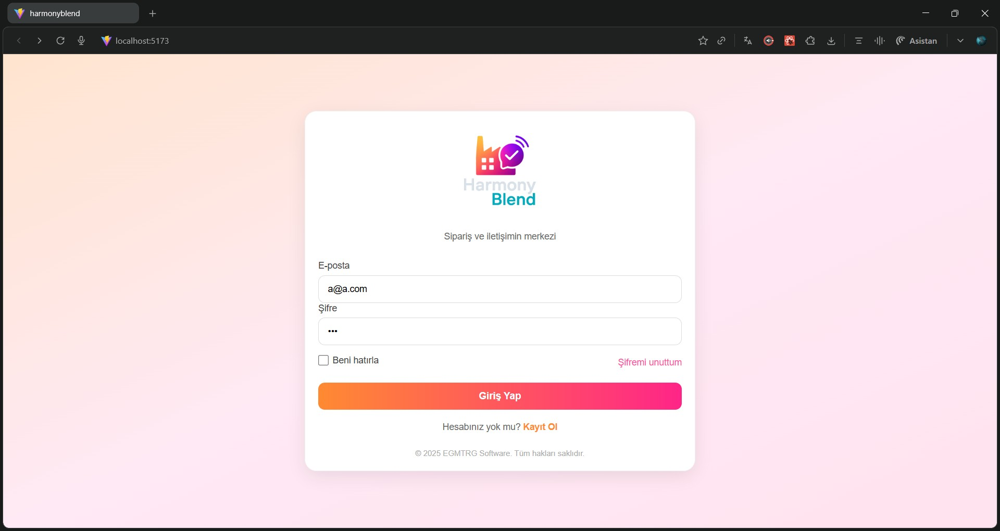

# HarmonyBlend

### All processes on a single platform.

  

<b>
A unified management platform that connects branches, operation teams, and factories through a modern order and communication system.
</b>

  
  
  
  

---

## 🚀 Project Overview

HarmonyBlend simplifies and centralizes the order, stock, communication, and operational workflows between branches and factories.  
It delivers a transparent, fast, and reliable management experience for multi‑branch companies.

---

## 🎯 Vision & Mission

- Eliminate complexity in ordering processes
- Ensure clean, traceable communication between branches and factories
- Improve regional control for operation teams
- Centralize factory stock, user, and product management
- Provide a self‑diagnosing error system with automated logs

---

## 🧩 Key Benefits

- ✔ Clean and intuitive interface
- ✔ Centralized order management for all branches
- ✔ Factory stock monitoring with threshold alerts
- ✔ Role‑based visibility and permissions
- ✔ Automatic error logging
- ✔ Multi‑brand / multi‑company support
- ✔ Full regional management for operation teams

---

## 🏛️ System Architecture

### 🔹 Web App

- Factory Administrator Panel
- Branch Panel
- Operation Team Panel
- User & Role Management
- Reporting & Analytics
- Optional ERP integration

### 🔹 Mobile App

- Quick order creation
- Notifications
- Order status tracking
- Draft system
- Optional offline mode

---

# ⚙️ Modules & Features

## 1. Branch Management

- Branch registration
- Assign warehouse, price lists, balance, and limits
- Multi‑brand support
- Login credentials
- Role selection
- Internal staff records

## 2. Order System

- Dynamic product lists by brand/company
- Product code, unit, price list, stock
- Branch only edits “requested quantity”
- External supplier (foreign product) orders
- Multi‑brand adaptive screens

## 3. Request & Needs Module

- Branch → Factory need requests
- Factory revision & approval
- Full logging

## 4. Operation Team Panel

- Region creation
- Branch → Region mapping
- Region manager assignment
- Root sharing
- Permission toggles

## 5. User Management

- All users in a single table
- Admin: one‑click login
- Password view/reset
- Limit & balance monitoring
- Active/passive status

## 6. Factory & Stock Management

- Warehouse stock overview
- Minimum stock alerts
- Product management
- Foreign product integrations

---

# 📊 Reporting

- Date‑based order reports
- Stock‑based analysis
- Branch performance
- Regional comparison
- Planned BI modules

---

# 🔐 Security

- Role‑based access (Admin / Branch / Factory / Operations)
- Custom role creation
- Permission‑level restrictions
- System‑wide logging
- Strong password & access validation

---

# 📦 Business Model

- SaaS subscription
- Factory‑based pricing
- Corporate plan
- ERP integration services
- BI reporting add‑ons
- Technical support & maintenance

---

# 🧱 Tech Stack

| Layer              | Technology                |
| ------------------ | ------------------------- |
| Frontend           | React.js + Vite           |
| Routing            | React Router DOM          |
| State              | Context / Custom Hooks    |
| Styling            | CSS / Tailwind (optional) |
| Backend (Planned)  | Node.js / .NET API        |
| Database (Planned) | SQL + Logging Tables      |

---

# 📸 Screenshots

### **Login Page**

### **Dashboard (Light Mode)**

### **Dashboard (Dark Mode)**

---

# 🏢 Developer

**EGMTRG SOFTWARE AND DEVELOPMENT.**  
Developer: **Egemen Turoğlu**
